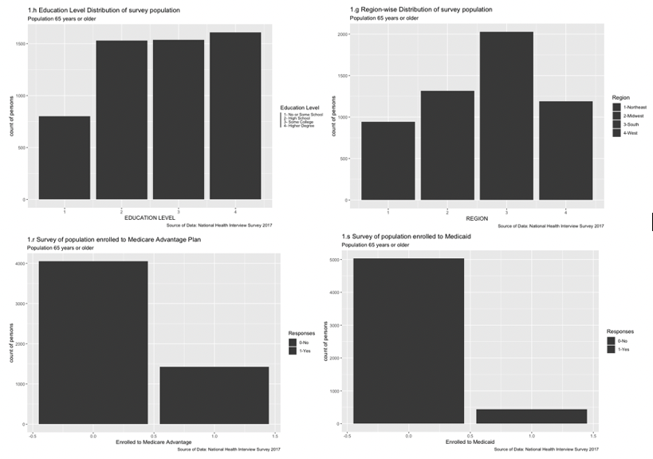
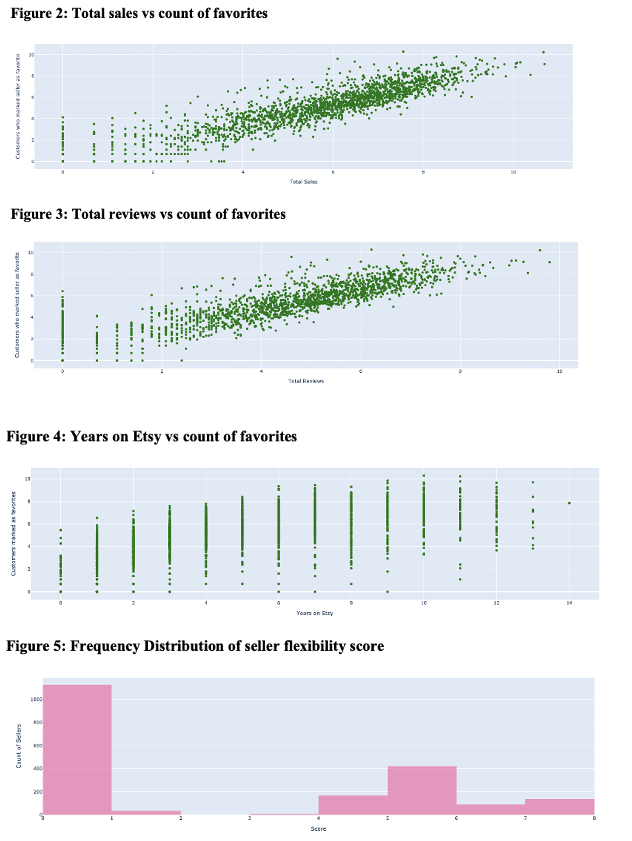
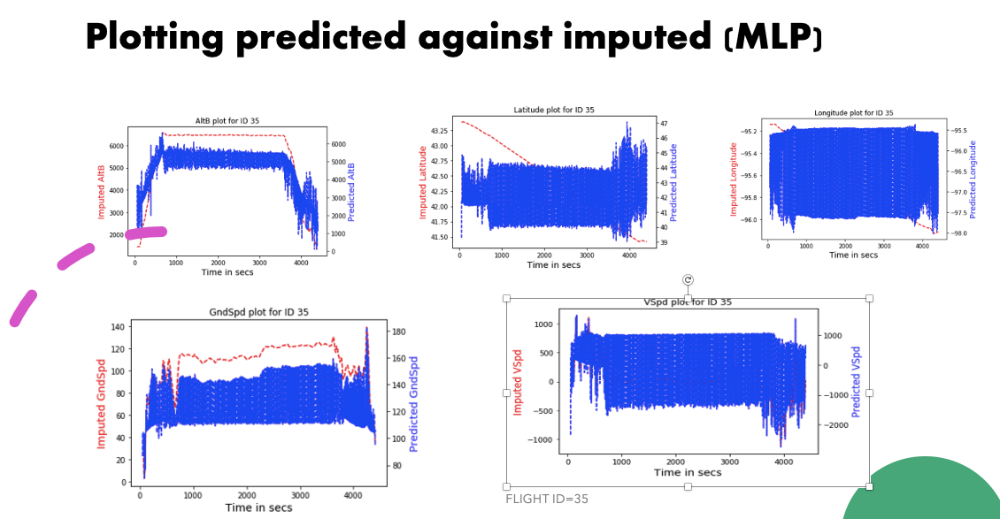
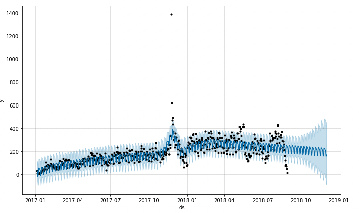

# Projects

### Project 1:  [Analysis of access to healthcare among seniors](https://github.com/paulamiguha/pg_master/tree/main/Academic_Projects/Research%20Methods)

    
Utilization of health care services varies across the seniors who are aged 65 and above. This paper tries to examine the problem of access to health services in terms of trouble finding a doctor. Using binary logistic regression, the paper investigates the effects of sociodemographic, economic status, type of insurance coverage and health status of the seniors on their access to health care.

The main findings of the paper show that seniors who are enrolled in Medicare Advantage plans have trouble finding a doctor. Elderly people who are residing in west region also have problem to get medical provider. Seniors who are male have less problem to access health services. Thus, the implication of policymakers is to ensure better access to health services among seniors

**Exploratory Data Analysis**
  

### Project 2: [An analysis of sellers of vintage music instruments on ETSY](https://github.com/paulamiguha/pg_master/tree/main/Academic_Projects/Tools%20for%20Data%20Analysis)  
 
    
The aim of this project is to provide buyers of vintage musical instruments, who are new to the Etsy website, a way to identify reliable sellers on the global marketplace. A seller’s popularity could be evaluated on the basis of the number of admirers (marked favorites) they have on Etsy. 
  
Etsy does not provide seller data directly for analysis purposes. I had to visit the Etsy vintage musical instruments catalog and web scrape into each product and seller page to get required information.

The main findings of the project were that total sales, total shop reviews, number of years in Etsy, seller shipping time, seller responsiveness score came significant, while Shop rating, seller responsiveness score and seller return score came as statistically insignificant. 
  
**Exploratory Data Analysis**
  
  
  
  

### Project 3: [Machine learning Contest with ADS-B Data](https://github.com/paulamiguha/pg_master/tree/main/Academic_Projects/MachineLearning)
  
  
The goal of this contest is to impute the missing values for location and speed in the ADS–B flight data.
Background. ADS–B data can be automatically collected from the aircraft’s navigation system (https: //en.wikipedia.org/wiki/Automatic_dependent_surveillance_%E2%80%93_broadcast). It provides the basic information of a flight, including the location (latitude, longitude, & altitude) and speed (ground speed & vertical speed). However, ADS-B data is not recorded by every second. In most ADS-B data sets, every two consecutive records can have a time gap of 15-30 seconds. It is a challenge to find out what happens during the time gap. Therefore, the task was to predict the location and speed by second for the ADS-B data.

The main learning of this project was that Machine learning methods were less accurate than interpolation methods in predicting the missing value variables.

**Exploratory Data Analysis**
  
  
  

  
### Project 4: [An Analysis of Sales of Olist (Brazilian e-commerce website)](https://github.com/paulamiguha/pg_master/tree/main/Academic_Projects/BusinessForecasting/Olist%20Data%20Sales%20Analysis)
  
  
The aim of this project was to forecast the following metrics :-
1. Forecast growth of overall daily sales over the next three months.
2. Future growth  forecast for the three best-selling categories in the dataset 
3. Growth rate of the fastest growing category 

We used forecasting techniques like ARIMA, Facebook Prophet model etc. to identify the metrics mentioned above. 
  
We identified in later periods the sales shows declining trend.

Bed bath and Table,health ad beauty and sports and leisure are the three best popular categories.

Finally, we determined the categories with the highest median growth rate. These categories were watches and gifts (20.5%), luggage and accessories (19%), pet shop (15%), food (12%) and air conditioning (10%). 

**Exploratory Data Analysis**

### Project 5: [Werner truck driver data analyis - who will quit in the next 30 days?](https://github.com/paulamiguha/Paulami_portfolio/tree/main/Academic_Projects/BusinessForecasting/Werner%20Driver%20Data%20Analysis)
  
  
The aim of this project was to forecast which drivers were most likely to quit in the next month, based on metrics provided in the dataset. I used Logistic Regression and Random Forest for prediction. 

The main findings of this project were that factors like - long-haul  , rehires, student drivers and  males were most likely to quit in the next 30 days.

